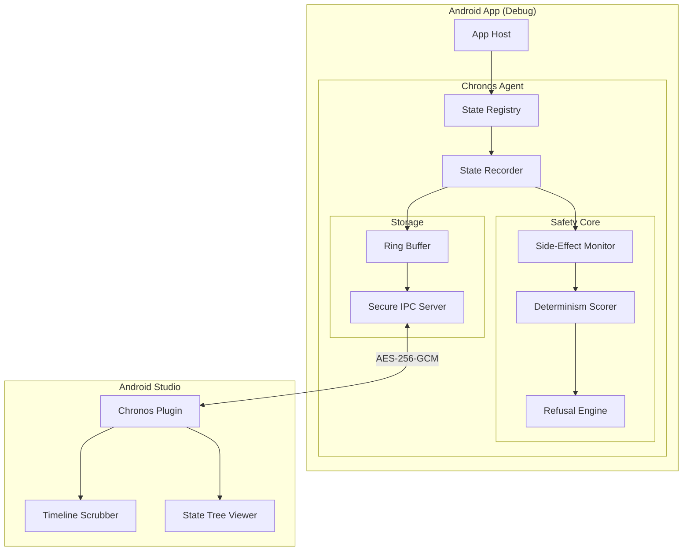

# Chronos: Trust-First Android Debugger ⏳

> **"Refuse early. Explain always. Never lie."**


Chronos is a state-recording debugger designed for **mission-critical Android applications**. Unlike traditional loggers that just record *what* happened, Chronos records the entire application state with guaranteed determinism, allowing you to replay scenarios with bit-perfect accuracy.

If Chronos cannot guarantee a perfect replay (e.g., due to network calls or race conditions), it **refuses to play** rather than showing you a misleading simulation.

---

## 🏛️ Architecture

Chronos is built on a "Safety First" architecture, ensuring strict isolation between your debug and release code.



### Key Components

| Component | Responsibility |
|-----------|----------------|
| **Determinism Scorer** | Analyzes state sources (Class A/B/C/D) to calculate replay safety. |
| **Refusal Engine** | Blocks replay if unsafe sources (Network, System Time) are involved. |
| **Secure IPC** | Transmits encrypted state data to Android Studio (AES-256-GCM). |
| **Ring Buffer** | High-performance, memory-capped storage for recent events. |
| **Replay Sandbox** | Blocks I/O operations (DB, Network) during replay to prevent side effects. |

---

## 🚀 Quick Start

### 1. Installation

Add the dependencies to your `app/build.gradle.kts` to ensure **ZERO** production impact.

```kotlin
dependencies {
    // Debug: Real Chronos Agent
    debugImplementation("com.chronos:chronos-agent:0.1.0")
    
    // Release: No-Op Stub (DOES NOTHING)
    releaseImplementation("com.chronos:chronos-agent-noop:0.1.0")
}
```

### 2. Initialization

Initialize Chronos in your `Application` class.

```kotlin
class MyApp : Application() {
    override fun onCreate() {
        super.onCreate()
        
        // Safe to call in all builds (No-op in release)
        Chronos.initialize(this)
    }
}
```

### 3. Registering State

Tell Chronos what to watch. Use `@ChronosDeterministic` for best results.

```kotlin
@ChronosDeterministic
data class UserState(val id: String, val name: String)

class MainViewModel : ViewModel() {
    private val _state = MutableStateFlow(UserState("1", "Alice"))
    
    init {
        Chronos.registerSource("MainViewModel", { _state.value })
    }
}
```

---

## 📚 Documentation

Detailed guides for deep integration and troubleshooting:

- **[Integration Guide](docs/INTEGRATION.md)**: Advanced setup, ProGuard rules, Multi-process support.
- **[Testing Guide](docs/TESTING.md)**: How to run unit tests and verify integration.
- **[Troubleshooting](docs/TROUBLESHOOTING.md)**: Solutions for common build and runtime errors.
- **[Migration](docs/MIGRATION.md)**: Moving from other logging tools.

---

## 🛡️ Security & Safety

Chronos is designed with paranoid security defaults:

1.  **Build Isolation**: `chronos-agent-noop` ensures NO executable code in release builds.
2.  **Privacy**: `@ChronosRedact` annotations automatically hide sensitive fields (passwords, tokens).
3.  **Encrypted Transport**: All communication between device and Studio is encrypted with per-session AES-256 keys.
4.  **Resource Protection**: `MemoryPressureMonitor` auto-pauses recording when device memory is low.

---

## 🤝 Contributing

We welcome contributions! Please see [CONTRIBUTING.md](CONTRIBUTING.md) for guidelines.

## 📄 License

Apache 2.0 - See [LICENSE](LICENSE) for details.
